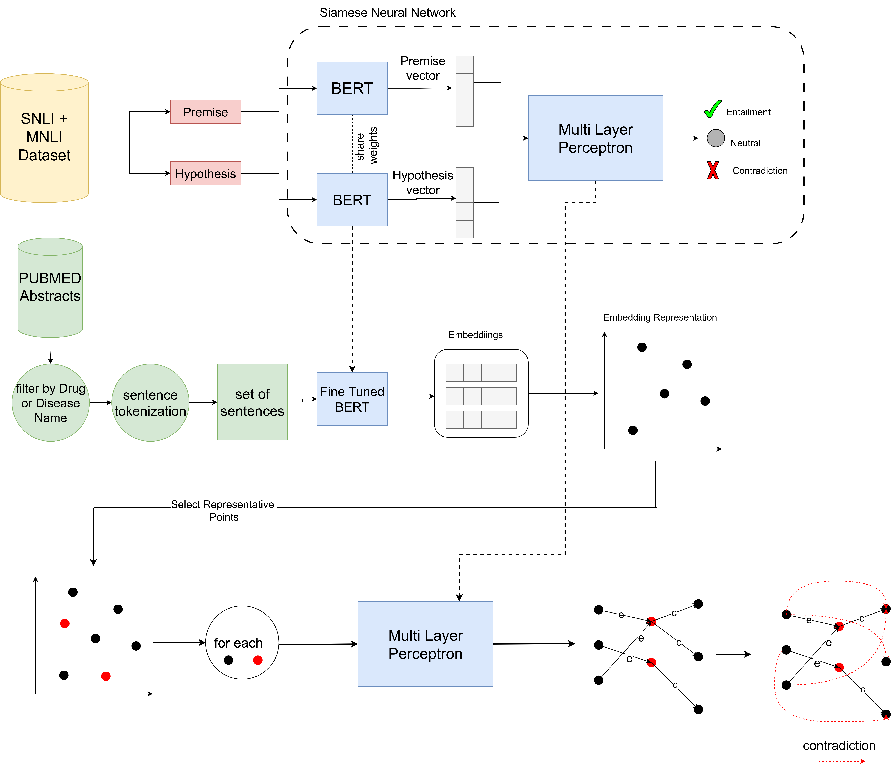

# CEMaT: Contradiction Extraction from Medical Texts using Natural Language Inference


This is the implementation of the paper CEMaT: Contradiction Extraction from Medical Texts using Natural Language Inference.

## Overview


To train Siamese network use following command

```bash
python train_siamese_network.py